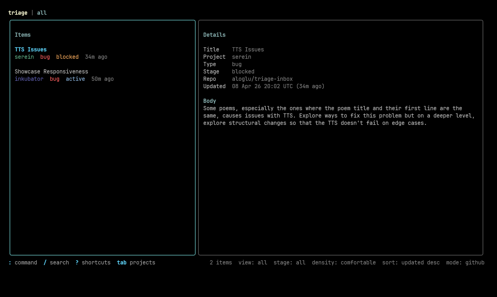

# triage

`triage` is a keyboard-first terminal UI for managing software project items.

It supports:

- local-only JSON storage
- optional GitHub Issues sync
- project filtering
- active/archive/trash views
- inline editing
- command palette workflows
- conflict handling for remote edits



## Stack

- Go
- Bubble Tea
- Lip Gloss

## Install

> [!NOTE]
> `triage` installs to your Go bin directory. If the command is not found after install, add your Go bin directory to `PATH`. In the default setup, that is `$(go env GOPATH)/bin`.

### Go install

```bash
go install github.com/aloglu/triage/cmd/triage@latest
```

If `$(go env GOPATH)/bin` is on your `PATH`, run:

```bash
triage
```

### From source

```bash
make install
```

If `triage` is still not found after install, add this to your shell config:

```bash
export PATH="$PATH:$(go env GOPATH)/bin"
```

Or install directly with Go:

```bash
go install ./cmd/triage
```

### Run without installing

```bash
make run
```

## Development

Run tests:

```bash
make test
```

Build a local binary:

```bash
make build
```

## First Run

On first launch, `triage` asks you to choose:

- local-only mode
- GitHub Issues sync

If you choose GitHub sync, enter the target repository in `owner/repo` form.

Current data/config locations are resolved through Go's user config directory:

- config: `triage/config.json`
- local cache/data: `triage/items.json`

On Linux, this is typically under `~/.config/triage/`.

## GitHub Sync

GitHub sync uses the `gh` CLI and expects you to already be authenticated.

Each item maps to one GitHub issue:

- issue title = item title
- issue body = YAML frontmatter + freeform markdown body
- labels are derived from `project`, `stage`, and trash state

Example issue body:

```md
---
project: triage
stage: active
---

Freeform notes here.
```

### Workflow states

`stage` is fixed to:

- `idea`
- `planned`
- `active`
- `blocked`
- `done`

### Views

- `all`: non-archived, non-trashed items
- `archive`: completed items (`stage: done`)
- `trash`: deleted-but-recoverable items

### GitHub lifecycle behavior

- `done` closes the GitHub issue and moves the item to `archive`
- `delete` moves the item to `trash`, adds a `trashed` label, and closes the issue
- `restore` removes the `trashed` label and reopens the issue
- `purge` permanently deletes the item locally and deletes the GitHub issue

`purge` requires sufficient GitHub permissions to delete issues.

## Daily Use

### Main shortcuts

- `?` open shortcuts modal
- `:` open command palette
- `tab` open project picker
- `j/k` or `↑/↓` move list or scroll details
- `h/l` or `←/→` switch panes
- `n` new item
- `e` edit selected item
- `s` sync
- `D` cycle `all -> archive -> trash`
- `q` quit

### Edit mode

- `tab` or `↑/↓` move fields
- `h/l` or `←/→` change `stage`
- `ctrl+s` save
- `esc` cancel

## Command Palette

Examples:

```text
:new
:edit
:sync
:view all
:view archive
:view trash
:project all
:project triage
:search auth
:search clear
:sort updated desc
:sort created asc
:delete
:restore
:purge
:storage local
:storage github owner/repo
:shortcuts
:quit
```

Autocomplete is built into the command palette:

- unique matches show inline ghost completion
- ambiguous matches open a suggestion list above the footer
- `tab`, `→`, or `enter` accept the highlighted suggestion

## Conflict Handling

If an issue changes on GitHub after your last sync and before your save, `triage` opens a conflict screen instead of overwriting blindly.

From that screen you can:

- keep the GitHub version
- overwrite GitHub with your local version
- cancel

## License

Released under the [MIT License](https://github.com/aloglu/triage/blob/main/LICENSE).
