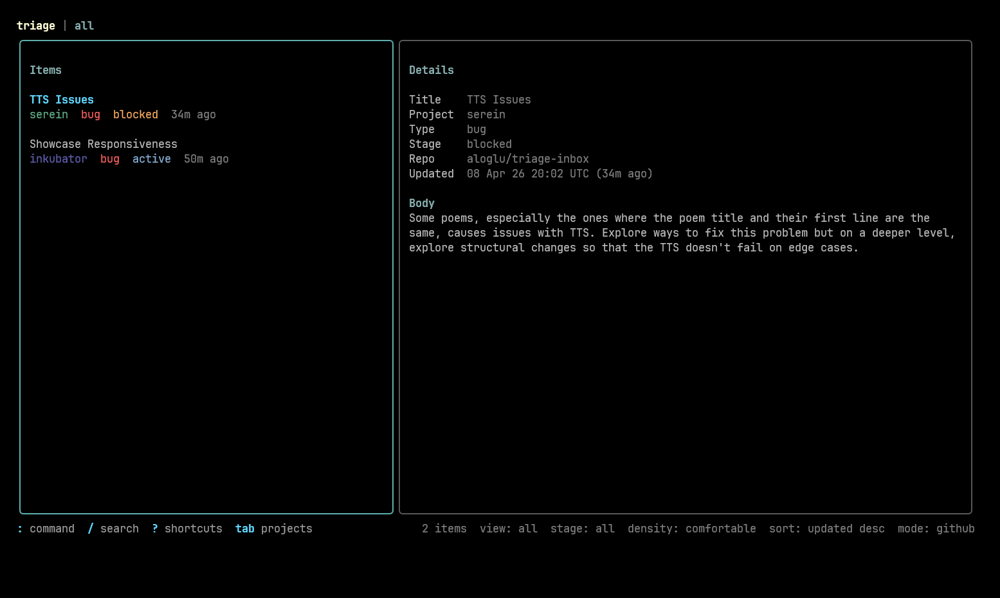

# triage

`triage` is a terminal workspace for managing software project work.

It is built for fast capture, editing, filtering, and review from the keyboard. You can use it as a local tool or sync items to GitHub Issues.



## Getting Started

Install with Go:

```bash
go install github.com/aloglu/triage/cmd/triage@latest
```

Or from source:

```bash
make install
triage
```

`triage` installs into your Go bin directory, usually `$(go env GOPATH)/bin`. If the command is not found after install, add that directory to your `PATH`:

```bash
export PATH="$PATH:$(go env GOPATH)/bin"
```

On first launch, choose where your items should live. If you enable GitHub sync, `gh` must already be installed and authenticated, and `triage` will ask for a default repository. A short Getting Started guide explains the core workflow; reopen it anytime with `:welcome`.

## Working Model

Each item has five core parts:

- title
- project
- type (`feature`, `bug`, `chore`)
- stage (`idea`, `planned`, `active`, `blocked`, `done`)
- body

The main views are `all`, `archive`, and `trash`.

In GitHub mode, edits are kept locally until you sync, so capture and editing stay quick even when GitHub is involved.

You can also drop draft files into a configurable drafts folder and let `triage` import them on startup or with `:drafts`.

## GitHub Sync

`triage` can sync to:

- a default repo
- a project-level repo default
- a per-item repo override

That makes it practical to keep a general inbox while routing project-specific work to dedicated repositories.

Manage repository routing from inside the app:

```text
:repo show
:repo default owner/repo
:repo project <project> owner/repo
:repo clear <project>
```

Edits remain local until you press `S` and confirm the sync. Use `:repos` to inspect the default repo, project mappings, and all currently tracked repositories.

### GitHub labels

`triage/managed` marks issues whose metadata labels are managed by the app. Issues without that marker keep their labels unchanged. On marked issues, triage uses familiar labels such as `bug`, `planned`, and the project name while preserving unrelated labels. Existing namespaced labels such as `triage/type/bug` are migrated only when you review and confirm a sync.

Metadata labels are optional. To stop triage from creating, updating, or removing conventional metadata labels—and have new issues receive only the ownership marker—run:

```text
:metadata-labels off
```

Existing conventional labels are left untouched when this setting is off; project, type, stage, and trash state remain in the issue body. Restore GitHub-facing metadata labels with `:metadata-labels on`. Project-label routing remains configurable with `:project-label always`, `:project-label auto`, or `:project-label never`.

## Uninstall

Preview the executable, configuration, local database, and drafts paths:

```bash
triage paths
triage uninstall --dry-run
```

Back up anything you want to keep, close the interactive app, and run the uninstaller:

```bash
triage uninstall
```

The command lists every path and asks for confirmation before deleting anything. Pay particular attention to a custom drafts folder because the whole configured folder is removed. To remove only the executable and preserve configuration, items, and drafts, use:

```bash
triage uninstall --keep-data
```

Use `--yes` only for non-interactive automation after reviewing the output from `--dry-run`. On Windows, the running executable may not be removable immediately; if that happens, triage prints the exact PowerShell command to run after it exits.

Uninstalling affects only the local application and its local data. Synced GitHub issues and repository labels are never deleted.

## Development

```bash
make run
make test
make build
```

## License

Released under the [MIT License](https://github.com/aloglu/triage/blob/main/LICENSE).
